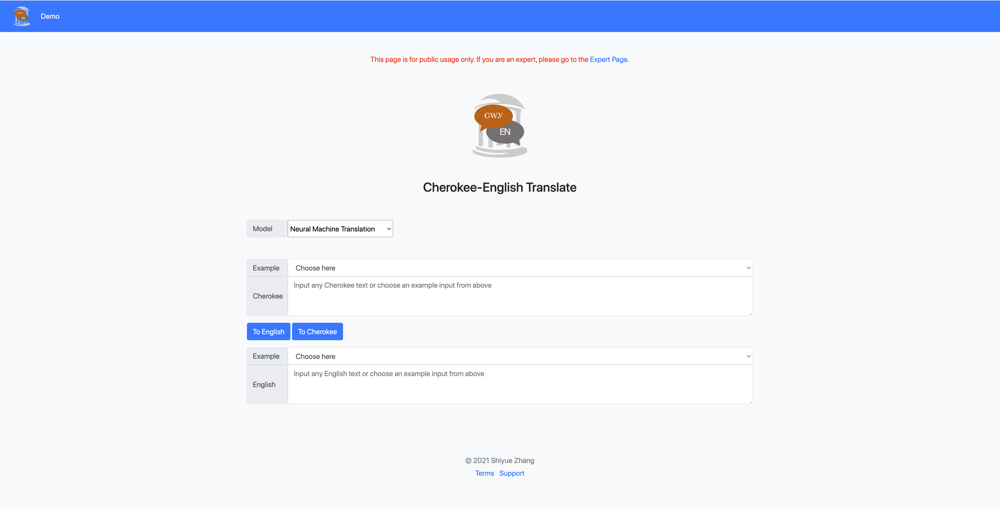

## Cherokee-English Translate Demo

### Online Website
Our demo is at https://chren.cs.unc.edu/. 
However, to avoid misusing, we have not opened it to the public yet. 

If you are an Cherokee-English expert and want to participate in our human-in-the-loop development,
do not hesitate to contact us (Shiyue Zhang, shiyue At cs.unc.edu).

### Local Setup

#### Models
Download NMT translation models, 
vocabulary files,
SMT translation models, 
and QE models from [here](https://drive.google.com/drive/folders/1XjYPp3YV-GL2WXGrFIVSXNxidY3yKv2y?usp=sharing).
Decompress all of them and put them under this code directory, e.g., ./ChrEnTranslate/models.

Note that, the data used to train our translation models is provided [here](https://github.com/ZhangShiyue/ChrEn/tree/main/data/demo/04112021).
This data is not necessary for setting up this demo.

#### Python Environment
```
python3.8 -m venv test
source test/bin/activate
pip install -r requirements.txt
```

Download our modified OpenNMT-py from [here](https://github.com/ZhangShiyue/ChrEn/tree/main/code/OpenNMT-py).
```
cd OpenNMT-py; python setup.py install
```

#### Moses
Download [mosesdecoder](https://github.com/moses-smt/mosesdecoder) and compile it 
following the [instruction](http://www.statmt.org/moses/?n=Development.GetStarted). 
Be sure to use --with-xmlrpc-c so that it can work as a [Service](http://www.statmt.org/moses/?n=Advanced.Moses).
Then, start the two SMT models in the background:
```
nohup mosesdecoder/bin/moses -f smt/enchr_demo_feedback_round2_ced/mert-work/moses.ini --server --server-port 5001 --server-log enchr.log &
nohup mosesdecoder/bin/moses -f smt/chren_demo_feedback_round2_ced/mert-work/moses.ini --server --server-port 5002 --server-log chren.log &
```
Here we use nohup, but any method that runs two models in the background should work.

#### MongoDB
Our demo requires [MongoDB](https://www.mongodb.com/) to store feedback and monolingual data.

After you setup your MongoDB, put your MONGO_URI in a file named confidential.py.

By default, we use the following collections:
* expert: for storing experts' feedback, 
e.g., { "_id" : ObjectId("xxx"), "type" : "tochr", "model" : "nmt", "en" : "I'm going to get some coffee.", "chr" : "ᎧᏫ ᏫᏓᏥᏁᎩᏏ.", "qe" : "1.9693317866337503", "rate" : "5", "text" : "ᎧᏫ ᏫᏓᏥᏁᎩᏏ.", "timestamp" : 1618012380.4715204, "comment" : "" }
* user: for storing common users' feedback, e.g., { "_id" : ObjectId("xxx"), "type" : "tochr", "model" : "nmt", "en" : "Hello", "chr" : "ᏏᏲ", "qe" : "2.840020728156041", "rate" : "5", "timestamp" : 1616613202.3531222, "comment" : "" }
* chr: for storing unlabeled Cherokee data, e.g., { "_id" : ObjectId("xxx"), "uid" : "040921_19", "text" : "ᏍᎩᏅ ᎠᏯᏨᏗ ᏍᎪᎢᏯᎦᏴᎵᎠᏕᎳ ᏚᎵᎬᏩᎳ?\"", "status" : "unlabeled" }
* en: for storing unlabeled English data, e.g., { "_id" : ObjectId("xxx"), "uid" : "3980085662.jpg#0r1e_2", "text" : "boys play football", "status" : "unlabeled" }

See ChrEnTranslator.py for how we use MongoDB.


#### Start
After the preparation above, simply start the demo by running:
```
python ChrEnTranslator.py 
```
Then you can access to the website via http://127.0.0.1:5000/ or http://127.0.0.1:5000/expert.

Here is a screen shot:



### Disclaimer
* Whenever you use our demo, you agree to be aware that the translations provided by our demo are translated by machines, 
are highly likely to be poor-quality, and are not supposed to be used anywhere else without confirmation from professional 
Cherokee-English translators.